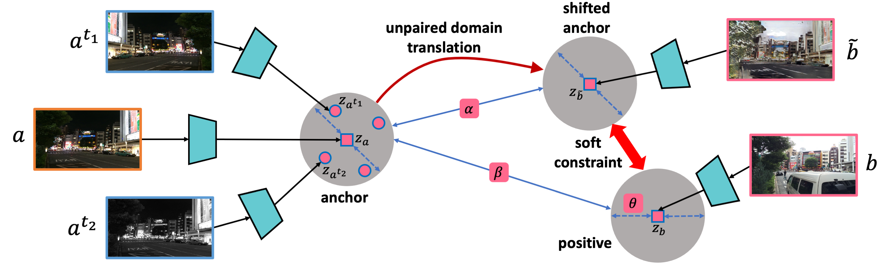
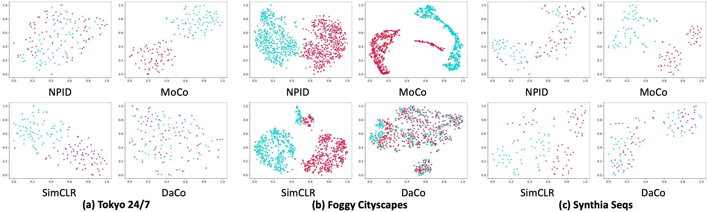

# Sketch

A PyTorch implementation of Sketch based on ACMMM 2021 paper [Sketch-based Image Retreval]().



## Requirements

- [Anaconda](https://www.anaconda.com/download/)
- [PyTorch](https://pytorch.org)

```
conda install pytorch=1.7.0 torchvision torchaudio cudatoolkit=11.0 -c pytorch
```

## Dataset

[CUFSF](http://mmlab.ie.cuhk.edu.hk/archive/cufsf/),
[ShoeV2](https://www.eecs.qmul.ac.uk/~qian/Project_cvpr16.html)
and [ChairV2](https://www.eecs.qmul.ac.uk/~qian/Project_cvpr16.html)
datasets are used in this repo, you could download these datasets from official websites, or download them from
[MEGA](https://mega.nz/folder/kx53iYoL#u_Zc6ogPokaTRVM6qYn3ZA). The data should be rearranged, please refer the paper to
acquire the details of `train/val` split. The data directory structure is shown as follows:

 ```
├──cufsf
   ├── original (orignal images)
       ├── train
           ├── A (sketch images)
               ├── A_1.jpg
               └── ...
           ├── B (photo images)
               ├── B_1.jpg
               └── ...
       ├── val
          same structure as train
          ...
   ├── generated (generated images)
       same structure as original
       ...
├──shoe
   same structure as cufsf
   ...
├──chair
   same structure as cufsf 
   ... 
```

## Usage

```
python main.py --data_name shoe --method_name simclr
optional arguments:
--data_root                   Datasets root path [default value is 'data']
--data_name                   Dataset name [default value is 'cufsf'](choices=['cufsf', 'shoe', 'chair'])
--method_name                 Method name [default value is 'daco'](choices=['daco', 'simclr'])
--proj_dim                    Projected feature dim for computing loss [default value is 128]
--temperature                 Temperature used in softmax [default value is 0.1]
--batch_size                  Number of images in each mini-batch [default value is 32]
--iters                       Number of bp over the model to train [default value is 40000]
--ranks                       Selected recall [default value is '1,2,4,8']
--save_root                   Result saved root path [default value is 'result']
```

## Benchmarks

The models are trained on one NVIDIA GTX TITAN (12G) GPU. `Adam` is used to optimize the model, `lr` is `1e-3`
and `weight decay` is `1e-6`. all the hyper-parameters are the default values.

### CUFSF
<table>
<thead>
  <tr>
    <th rowspan="2">Method</th>
    <th colspan="4">Day --&gt; Night</th>
    <th colspan="4">Night --&gt; Day</th>
    <th colspan="4">Day &lt;--&gt; Night</th>
    <th rowspan="2">Download</th>
  </tr>
  <tr>
    <td align="center">R@1</td>
    <td align="center">R@2</td>
    <td align="center">R@4</td>
    <td align="center">R@8</td>
    <td align="center">R@1</td>
    <td align="center">R@2</td>
    <td align="center">R@4</td>
    <td align="center">R@8</td>
    <td align="center">R@1</td>
    <td align="center">R@2</td>
    <td align="center">R@4</td>
    <td align="center">R@8</td>
  </tr>
</thead>
<tbody>
  <tr>
    <td align="center">SimCLR</td>
    <td align="center">29.33</td>
    <td align="center">33.33</td>
    <td align="center">45.33</td>
    <td align="center">58.67</td>
    <td align="center">32.00</td>
    <td align="center">40.00</td>
    <td align="center">46.67</td>
    <td align="center">57.33</td>
    <td align="center">6.00</td>
    <td align="center">10.00</td>
    <td align="center">14.00</td>
    <td align="center">20.00</td>
    <td align="center"><a href="https://pan.baidu.com/s/1yZhkba1EU79LwqgizDzTUA">agdw</a></td>
  </tr>
  <tr>
    <td align="center">DaCo</td>
    <td align="center"><b>69.33</b></td>
    <td align="center"><b>73.33</b></td>
    <td align="center"><b>81.33</b></td>
    <td align="center"><b>88.00</b></td>
    <td align="center"><b>65.33</b></td>
    <td align="center"><b>80.00</b></td>
    <td align="center"><b>85.33</b></td>
    <td align="center"><b>90.67</b></td>
    <td align="center"><b>52.00</b></td>
    <td align="center"><b>60.67</b></td>
    <td align="center"><b>73.33</b></td>
    <td align="center"><b>81.33</b></td>
    <td align="center"><a href="https://pan.baidu.com/s/139IHtS2_tOZcEK2Qgt-yQw">5dzs</a></td>
  </tr>
</tbody>
</table>

### ShoeV2

<table>
<thead>
  <tr>
    <th rowspan="2">Method</th>
    <th colspan="4">Clear --&gt; Foggy</th>
    <th colspan="4">Foggy --&gt; Clear</th>
    <th colspan="4">Clear &lt;--&gt; Foggy</th>
    <th rowspan="2">Download</th>
  </tr>
  <tr>
    <td align="center">R@1</td>
    <td align="center">R@2</td>
    <td align="center">R@4</td>
    <td align="center">R@8</td>
    <td align="center">R@1</td>
    <td align="center">R@2</td>
    <td align="center">R@4</td>
    <td align="center">R@8</td>
    <td align="center">R@1</td>
    <td align="center">R@2</td>
    <td align="center">R@4</td>
    <td align="center">R@8</td>
  </tr>
</thead>
<tbody>
  <tr>
    <td align="center">SimCLR</td>
    <td align="center">43.00</td>
    <td align="center">55.60</td>
    <td align="center">67.20</td>
    <td align="center">76.60</td>
    <td align="center">69.40</td>
    <td align="center">80.40</td>
    <td align="center">89.20</td>
    <td align="center">94.00</td>
    <td align="center">2.30</td>
    <td align="center">3.70</td>
    <td align="center">5.20</td>
    <td align="center">7.80</td>
    <td align="center"><a href="https://pan.baidu.com/s/1ogY5eC1eb3IHemOsVO-ieg">hdhn</a></td>
  </tr>
  <tr>
    <td align="center">DaCo</td>
    <td align="center"><b>96.40</b></td>
    <td align="center"><b>99.00</b></td>
    <td align="center"><b>99.60</b></td>
    <td align="center"><b>99.80</b></td>
    <td align="center"><b>95.60</b></td>
    <td align="center"><b>97.80</b></td>
    <td align="center"><b>99.40</b></td>
    <td align="center"><b>99.80</b></td>
    <td align="center"><b>47.70</b></td>
    <td align="center"><b>65.30</b></td>
    <td align="center"><b>80.10</b></td>
    <td align="center"><b>91.00</b></td>
    <td align="center"><a href="https://pan.baidu.com/s/1ForxWPJ_k3Eq_EXgLtpHCA">azvx</a></td>
  </tr>
</tbody>
</table>

### ChairV2

<table>
<thead>
  <tr>
    <th rowspan="2">Method</th>
    <th colspan="4">Sunset --&gt; Rainy Night</th>
    <th colspan="4">Rainy Night --&gt; Sunset</th>
    <th colspan="4">Sunset &lt;--&gt; Rainy Night</th>
    <th rowspan="2">Download</th>
  </tr>
  <tr>
    <td align="center">R@1</td>
    <td align="center">R@2</td>
    <td align="center">R@4</td>
    <td align="center">R@8</td>
    <td align="center">R@1</td>
    <td align="center">R@2</td>
    <td align="center">R@4</td>
    <td align="center">R@8</td>
    <td align="center">R@1</td>
    <td align="center">R@2</td>
    <td align="center">R@4</td>
    <td align="center">R@8</td>
  </tr>
</thead>
<tbody>
  <tr>
    <td align="center">SimCLR</td>
    <td align="center">25.00</td>
    <td align="center">35.00</td>
    <td align="center">40.00</td>
    <td align="center">53.33</td>
    <td align="center">20.00</td>
    <td align="center">26.67</td>
    <td align="center">41.67</td>
    <td align="center">48.33</td>
    <td align="center">6.67</td>
    <td align="center">9.17</td>
    <td align="center">15.83</td>
    <td align="center">24.17</td>
    <td align="center"><a href="https://pan.baidu.com/s/1l5D86pAkI9duvDH_AQOZVQ">afeg</a></td>
  </tr>
  <tr>
    <td align="center">DaCo</td>
    <td align="center"><b>46.67</b></td>
    <td align="center"><b>66.67</b></td>
    <td align="center"><b>75.00</b></td>
    <td align="center"><b>88.33</b></td>
    <td align="center"><b>45.00</b></td>
    <td align="center"><b>50.00</b></td>
    <td align="center"><b>70.00</b></td>
    <td align="center"><b>86.67</b></td>
    <td align="center"><b>28.33</b></td>
    <td align="center"><b>39.17</b></td>
    <td align="center"><b>50.00</b></td>
    <td align="center"><b>67.50</b></td>
    <td align="center"><a href="https://pan.baidu.com/s/1PHednJb8PQ2FVb6Ht8jJTg">sasq</a></td>
  </tr>
</tbody>
</table>

## Results

### CUFSF


### ShoeV2


### ChairV2


### T-SNE


