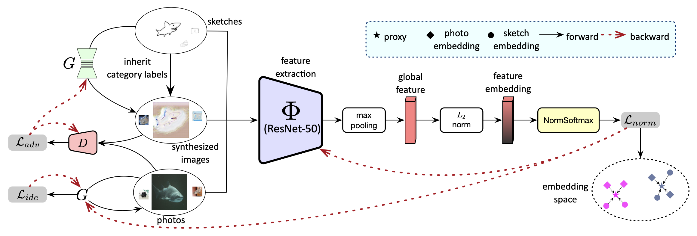
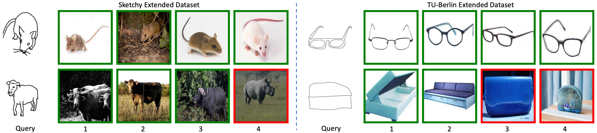

# UG

A PyTorch implementation of UG based on CVPR 2022 paper
[Zero-Shot Sketch-Based Image Retrieval with Unidirectional Generator]().



## Requirements

- [Anaconda](https://www.anaconda.com/download/)
- [PyTorch](https://pytorch.org)

```
conda install pytorch=1.10.0 torchvision cudatoolkit=11.3 -c pytorch
```

- [Pytorch Metric Learning](https://kevinmusgrave.github.io/pytorch-metric-learning/)

```
pip install pytorch-metric-learning
```

- [Faiss](https://faiss.ai)

```
conda install -c pytorch faiss-cpu
```

- [Timm](https://rwightman.github.io/pytorch-image-models/)

```
pip install timm
```

## Dataset

[Sketchy Extended](http://sketchy.eye.gatech.edu) and
[TU-Berlin Extended](http://cybertron.cg.tu-berlin.de/eitz/projects/classifysketch/) datasets are used in this repo, you
could download these datasets from official websites, or download them from
[Google Drive](https://drive.google.com/drive/folders/1lce41k7cGNUOwzt-eswCeahDLWG6Cdk0?usp=sharing). The data directory
structure is shown as follows:

 ```
├──sketchy
   ├── train
       ├── sketch
           ├── airplane
               ├── n02691156_58-1.jpg
               └── ...
           ...
       ├── photo
           same structure as sketch
   ├── val
      same structure as train
      ...
├──tuberlin
   same structure as sketchy
   ...
```

## Usage

### Train Model

```
python train.py --data_name tuberlin
optional arguments:
--data_root                   Datasets root path [default value is '/data']
--data_name                   Dataset name [default value is 'sketchy'](choices=['sketchy', 'tuberlin'])
--backbone_type               Backbone type [default value is 'resnet50'](choices=['resnet50', 'vgg16'])
--emb_dim                     Embedding dim [default value is 512]
--batch_size                  Number of images in each mini-batch [default value is 64]
--epochs                      Number of epochs over the model to train [default value is 10]
--warmup                      Number of warmups over the extractor to train [default value is 1]
--save_root                   Result saved root path [default value is 'result']
```

### Test Model

```
python test.py --num 8
optional arguments:
--data_root                   Datasets root path [default value is '/data']
--query_name                  Query image name [default value is '/data/sketchy/val/sketch/cow/n01887787_591-14.jpg']
--data_base                   Queried database [default value is 'result/sketchy_resnet50_2048_vectors.pth']
--num                         Retrieval number [default value is 10]
--save_root                   Result saved root path [default value is 'result']
```

## Benchmarks

The models are trained on one NVIDIA GTX TITAN (12G) GPU. `Adam` is used to optimize the model, `lr` is `1e-5`
for backbone, `1e-3` for generator and `1e-4` for discriminator. all the hyper-parameters are the default values.

<table>
<thead>
  <tr>
    <th rowspan="3">Backbone</th>
    <th rowspan="3">Dim</th>
    <th colspan="4">Sketchy Extended</th>
    <th colspan="4">TU-Berlin Extended</th>
    <th rowspan="3">Download</th>
  </tr>
  <tr>
    <td align="center">mAP@200</td>
    <td align="center">mAP@all</td>
    <td align="center">P@100</td>
    <td align="center">P@200</td>
    <td align="center">mAP@200</td>
    <td align="center">mAP@all</td>
    <td align="center">P@100</td>
    <td align="center">P@200</td>
  </tr>
</thead>
<tbody>
  <tr>
    <td align="center">VGG16</td>
    <td align="center">64</td>
    <td align="center">53.0</td>
    <td align="center">38.0</td>
    <td align="center">50.1</td>
    <td align="center">46.0</td>
    <td align="center">54.7</td>
    <td align="center">37.4</td>
    <td align="center">52.2</td>
    <td align="center">49.4</td>
    <td align="center"><a href="https://pan.baidu.com/s/14lJMIRCMJIIM4QrP_Gbqfg">e8db</a></td>
  </tr>
  <tr>
    <td align="center">VGG16</td>
    <td align="center">512</td>
    <td align="center">57.5</td>
    <td align="center">42.6</td>
    <td align="center">54.6</td>
    <td align="center">50.6</td>
    <td align="center">62.3</td>
    <td align="center">44.6</td>
    <td align="center">60.1</td>
    <td align="center">57.1</td>
    <td align="center"><a href="https://pan.baidu.com/s/1rdyX8S4J7hHrDk33QHip1A">uiv4</a></td>
  </tr>
  <tr>
    <td align="center">VGG16</td>
    <td align="center">4096</td>
    <td align="center">58.6</td>
    <td align="center">44.4</td>
    <td align="center">56.0</td>
    <td align="center">51.9</td>
    <td align="center">64.3</td>
    <td align="center">47.6</td>
    <td align="center">62.5</td>
    <td align="center">59.7</td>
    <td align="center"><a href="https://pan.baidu.com/s/1z30aDG-ra0owr2P59SnpZA">mb9f</a></td>
  </tr>
  <tr>
    <td align="center">ResNet50</td>
    <td align="center">128</td>
    <td align="center">62.6</td>
    <td align="center">48.7</td>
    <td align="center">60.4</td>
    <td align="center">56.4</td>
    <td align="center">61.2</td>
    <td align="center">46.2</td>
    <td align="center">59.4</td>
    <td align="center">57.6</td>
    <td align="center"><a href="https://pan.baidu.com/s/1aK2xiSPZRPXuORoH-8-aoQ">c7h4</a></td>
  </tr>
  <tr>
    <td align="center">ResNet50</td>
    <td align="center">512</td>
    <td align="center">66.2</td>
    <td align="center">53.2</td>
    <td align="center">63.9</td>
    <td align="center">60.1</td>
    <td align="center">64.8</td>
    <td align="center">50.3</td>
    <td align="center">63.0</td>
    <td align="center">61.1</td>
    <td align="center"><a href="https://pan.baidu.com/s/1N7iYhbj6GBQ3byRPoekFHA">mhmm</a></td>
  </tr>
  <tr>
    <td align="center">ResNet50</td>
    <td align="center">2048</td>
    <td align="center">66.6</td>
    <td align="center">53.6</td>
    <td align="center">64.5</td>
    <td align="center">60.7</td>
    <td align="center">65.6</td>
    <td align="center">53.7</td>
    <td align="center">64.2</td>
    <td align="center">62.7</td>
    <td align="center"><a href="https://pan.baidu.com/s/1unfflapyOiRvqEbYMZH-gg">5vcy</a></td>
  </tr>
</tbody>
</table>

## Results


